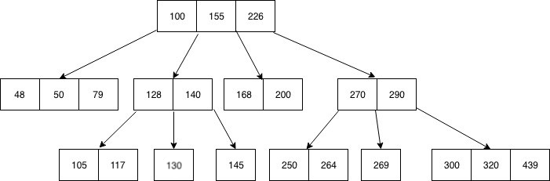
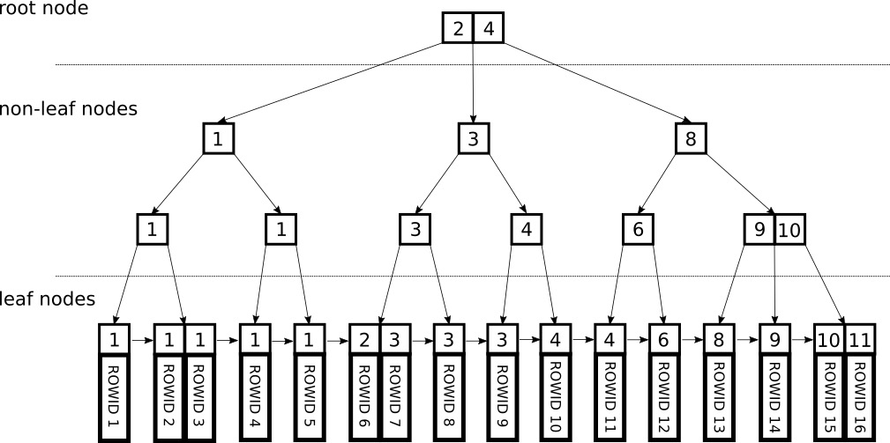

#### Notas sobre índices
# **Índices simples, compostos, únicos e parciais**

## | ***Simples***
Criados usando apenas **uma coluna** de uma tabela:

**(exemplo)** CREATE INDEX index_name ON table_name (column_name);

## | ***Compostos***
Criados usando **duas ou mais coluna** de uma tabela:

**(exemplo)** CREATE INDEX index_name ON table_name (column1_name, column2_name);

## | ***Únicos***
Criados com performance e integridade em vista. Estes índices não permitem que existam registos duplicados na tabela auxiliar:

**(exemplo)** CREATE UNIQUE INDEX index_name
ON table_name (column_name);

## | ***Parciais***
Criados com base numa **partição** da tabela original, definida por uma condição WHERE (chamado o  **predicado** do índice parcial)

**(exemplo)** CREATE INDEX index_name ON table_name (conditional_expression);

# **Tipos de algoritmos para criação de índices no PostgreSQL**
## | ***B-Tree***
Tipo mais comum e **adequado na maioria das situações**. São a evolução do conceito de árvore binária, sendo que cada nó pode ter **mais que 2 filhos e mais que 1 chave (valor(es) dentro do nó)**.

A desvantagem é que as operações de **inserção ou remoção são caras**, dados que a árvore tem que se rebalançar e a **complexidade espacial é elevada** (quando comparada a outros métodos).

*Exemplo de b-tree de ordem 4 (cada nó tem no máximo 4 filhos)*

No exemplo acima, a raiz tem 3 chaves (100, 155 e 226) e 4 apontadores para filhos (o número de filhos é sempre 0-n+1, com n = número de chaves). Deste modo e contrariamente às árvores binárias tradicionais, cada nó contém **vários intervalos de valores** e não apenas 1 valor.

A pesquisa tem complexidade O(log n) e segue o seguinte método: no nó atual, verificar em que intervalo se encaixa o valor a procurar e seguir pelo apontador correspondente.

**(exemplo)** 
1. **145 ficaria no intervalo 100-155**, pelo que seguimos pelo **2º apontador/filho da raiz**;
2. No filho desta, **145 fica no intervalo >140**, logo seguimos pelo **3º apontador/filho**;
3. Chegámos ao 145 e a pesquisa termina.

*Exemplo de b-tree numa BD*

No caso das Bases de Dados, e visível na imagem acima, os nós-folha guardam o valor do índice (o atributo sobre o qual o índice foi criado, ex: idade, nome, etc...) e o apontador para o registo na tabela original que contém esse valor. 

Se o 10º registo de uma tabela "A" tem os atributos (idade=12, nome="Marquinhos") e um índice foi criado sobre a idade, então um nó-folha teria o par (12, apontador_registo_10_tabela_A).

## | ***Hash***
Este tipo de índice usa tabelas de *hash* para referenciar a informação. É particularmente útil em **pesquisas por igualdade**. Assim, o *query planner* irá considerar índices com recurso a *hash* quando as colunas indexadas estão involvidas em comparações que usam o operador de igualdade (=).

## | ***GiST***
Significa "**G**eneralized **S**earch **T**ree" e é viável em **pesquisas de texto e dados geométricos**. 

Na pesquisa por texto, o seu mecanismo baseia-se no seguinte: representar cada palavra num bit único usando uma função de *hash*, formando uma string de "n" bits (para cada palavra é determinada a posição).

Na pesquisa geométrica, são colocadas *bounding boxes* à volta das formas geométricas a procurar e usando apenas as *bounding boxes* que se sobrepõem numa *querie*, o espaço a procurar diminui:

*Exemplo de procura geométrica (e.g. *query* = "que linhas intersetam a estrela?", usando as *bounding boxes* ficamos com a vermelha e azul  - a *bounding box* verde não se sobrepõe à amarela)*

É *lossy*, o que quer dizer que existem resultados falsos (vários fatores contribuem para tal fenómeno, como por exemplo o número de palavras únicas).

## | ***SP-GiST***
Tem o propósito de permitir o desenvolvimento de tipo de dados personalizados com os métodos de acesso adequados, por parte de um especialista nesse tipo de dados.

## | ***GIN***
Significa **G**eneralized **I**nverted **I**ndex e é adequado para *queries* em que se pretende **obter resultados parciais e os itens a indexar são compostos** (e.g. os itens podem ser documentos e as *queries* serem pesquisas por documentos que contenham certas palavras).
Outro exemplo seria ter itens compostos como nomes, por exemplo. "Maria Pereira" e "Pedro Araújo" deveriam ser retornados caso a pesquisa tivesse "Pe", por exemplo.

**Também são adequados para pesquisas por texto.**

## | ***BRIN***
Significa **B**lock **R**ange **IN**dex e, baseado no manuseamento de páginas (a unidade fundamental com a qual o PostgreSQL guarda os dados), guarda, para cada entrada na tabela de indices, **o menor e maior valor de uma página** (um intervalo basicamente).

Assim é **útil para pesquisas que envolvam datas e *timestamps***.